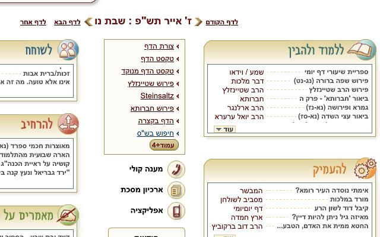
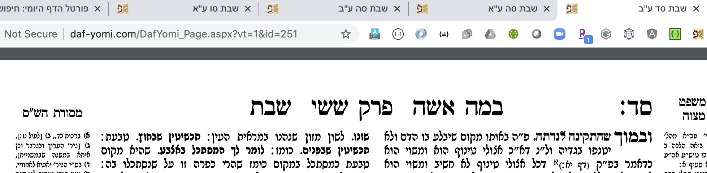
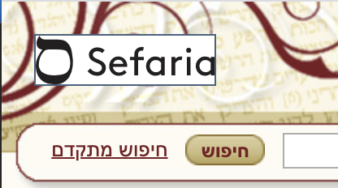
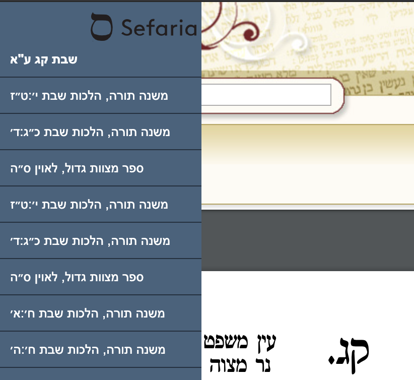
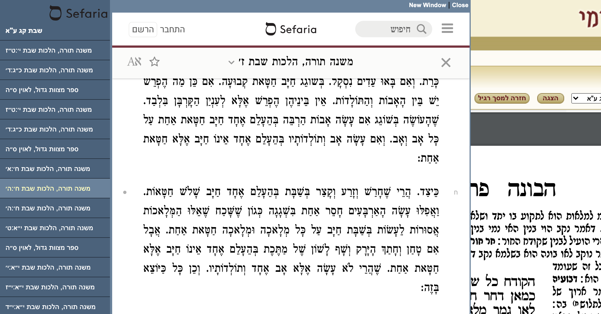

# DafYomi Portal Chrome Extension

Simple Chrome extension to help load today's Daf and the Amud before and after.

Designed to work on daf-yomi.com.

When installed, any page that's loaded on "Tzuras Hadaf" will maximize and scroll to the PDF viewer on the page.

On the homepage for Daf-Yomi.com you will see a red link that sets up 4 tabs on today's daf and the amud before and after.

*New in 1.5*
Style fixes to dockbar. Content now loads inline on the page. (The next enhancement will be to split off the Sefaria Dockbar into a new extension). This will be ported over to https://github.com/DovOps/SefariaSidebarExtension

*New in 1.4*
Sefaria Logo Button will appear on the top-left corner of the page. Clicking it will toggle a link to the Daf on Sefaria, as well as a link to all 'Ner Mitzvah / Torah Or' links on Sefaria that are referenced by the Amud being displayed.

# Example Screenshots 

